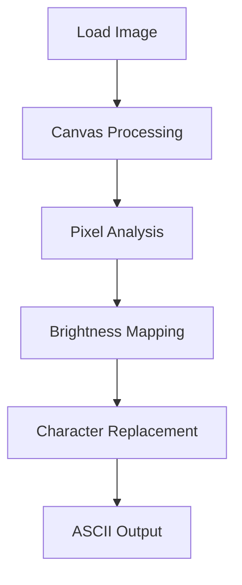

# ASCII Art Studio 🎨

**Real-time image-to-ASCII converter** with customizable output. Perfect for artists, developers, and terminal enthusiasts!

## ✨ Features

- 🖼️ **Multiple Image Sources**: Upload from device, URL, or use built-in samples
- 🎚️ **Real-time Controls**: Adjust width, contrast, brightness
- 🔠 **5+ Character Sets**: Blocks, dots, binary, and more
- 🔄 **Invert Colors**: Switch between dark/light modes
- 📋 **Copy & Download**: Save your ASCII art as text
- 📱 **Responsive Design**: Works on desktop and mobile

## 🚀 Quick Start

1. **Run locally**:
   ```bash
   git clone https://github.com/ferhatgnlts/ascii-art-studio.git
   cd ascii-art-studio
   open index.html  # Or use your preferred browser
   ```

2. **Use the demo**:
   - Visit [Live Demo](https://ferhatgnlts.github.io/ASCII-Art-Studio/)
   - Drag & drop any image
   - Tweak settings and enjoy!

## 🛠️ How It Works



## 🎚️ Customization Options

| Setting        | Range          | Effect                          |
|----------------|----------------|---------------------------------|
| **Width**      | 50-300 px      | Controls output resolution      |
| **Contrast**   | 50-150%        | Enhances light/dark differences |
| **Brightness** | 50-150%        | Adjusts overall lightness       |
| **Charset**    | 5 presets      | Changes artistic style          |

## 🌟 Pro Tips

- Use **high-contrast images** for best results
- Try the **"blocks" charset** for retro terminal looks
- Combine with `cmatrix` for hacker-style displays!

## 🤝 Contributing

We love contributions! Here's how to help:
1. Fork the project
2. Create a branch (`git checkout -b cool-feature`)
3. Commit changes (`git commit -m 'Add amazing feature'`)
4. Push (`git push origin cool-feature`)
5. Open a PR

## 📜 License

MIT © [Ferhat Gönültaş](https://github.com/ferhatgnlts)

---

Made with ♥ and JavaScript
